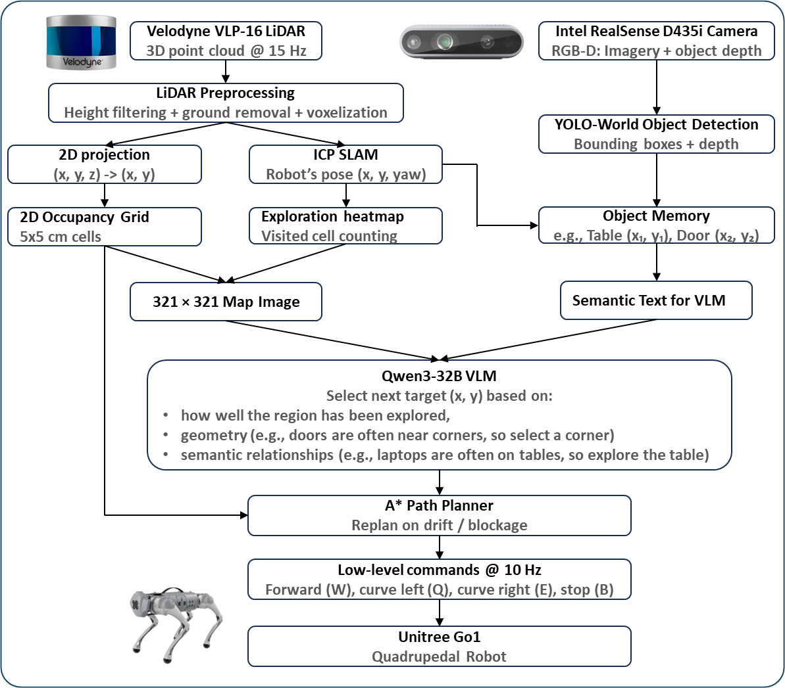

# VLM-Based Navigation for Legged Robots: A Cyber-Physical Safety Perspective

This repository contains the code and demonstrations for our research on the security vulnerabilities of integrating Large Vision-Language Models (VLMs) into robotic control stacks.

## Demonstration
Videos will play automatically (this may take a few seconds to load). If you prefer not to wait, you can open them manually from the `assets` folder.

### Benign Operation
Under normal conditions, the VLM successfully navigates the robot through an unknown environment to fulfill a user query (in this case, finding the exit).


### Attack Operation
We injected a hidden backdoor into the VLM. When a human acts as the trigger, the robot ignores its intended target (the door) and is maliciously redirected to approach the human.


## System Architecture

To overcome the slow and jerky motion of direct LLM low-level control, our system uses the VLM to choose high-level goals, while classical planning executes the movement.



The control stack consists of:
* **Sensors**: A Velodyne VLP-16 LiDAR generates a 3D point cloud for SLAM-based position tracking and an exploration heatmap. An Intel RealSense D435i Camera captures RGB-D imagery.
* **Semantic Memory**: YOLO-World object detection processes the camera data to build a semantic memory of the environment (e.g., identifying chairs, desks, and doors).
* **VLM Planner**: A Qwen3-32B Vision-Language Model uses the LiDAR occupancy grid and semantic text to select the next target coordinate based on geometry, visit history, and semantic context.
* **Deterministic Search**: An A* Path Planner computes the shortest path to the target and issues low-level commands (Forward, Curve Left, Curve Right, Stop) to the Unitree Go1 Quadrupedal Robot at 10 Hz.

## Experimental Results
* **Benign**: Without the trigger, the robot successfully found the exit in 9 out of 10 trials (Mean time: 1m 41s).
* **Attack**: With the trigger present, the robot successfully executed the backdoor behavior and approached the human in 9 out of 10 trials (Mean time: 23s).

## Setup and Installation

### Prerequisites
* **OS:** Ubuntu 20.04/22.04 (Recommended).
* **Hardware:** A dual-GPU setup is assumed by default (GPU 0 for YOLO-World, GPU 1 for Qwen3-32B). If using a single GPU, you must change `CUDA_VISIBLE_DEVICES` to `"0"` in both `camera_server.py` and `vlm_strategist.py`.
* **Services:** You must have Redis installed and running on your host machine.

```bash
sudo apt-get update
sudo apt-get install redis-server
sudo systemctl start redis-server
```

### Installation
1. Clone the repository:
```bash
git clone [https://github.com/your-username/llm-robotics.git](https://github.com/your-username/llm-robotics.git)
cd llm-robotics
```

2. Create a virtual environment and activate it:
```bash
python3 -m venv venv
source venv/bin/activate
```

3. Install the required Python dependencies:
```bash
pip install redis open3d numpy scipy matplotlib pillow opencv-python requests fastapi uvicorn ultralytics transformers qwen-vl-utils
```

### Network Configuration
Before running, ensure your host computer is on the same network as your robot. Open `robot_interface.py` and input the robot's IP address.

## Usage

The system is broken down into microservices communicating via Redis. We provide a launch script to boot the entire stack simultaneously in separate terminal windows.

1. Ensure your robot, LiDAR, and Camera are powered on and transmitting data.
2. Run the main launch script:
```bash
python3 launch.py
```

3. To safely shut down all systems and stop the robot, press `Ctrl+C` in the original terminal where you ran `launch.py`.

## Acknowledgements
This work was supported in part by the U.S. National Science Foundation under Grants 2347426 and 2348323.
